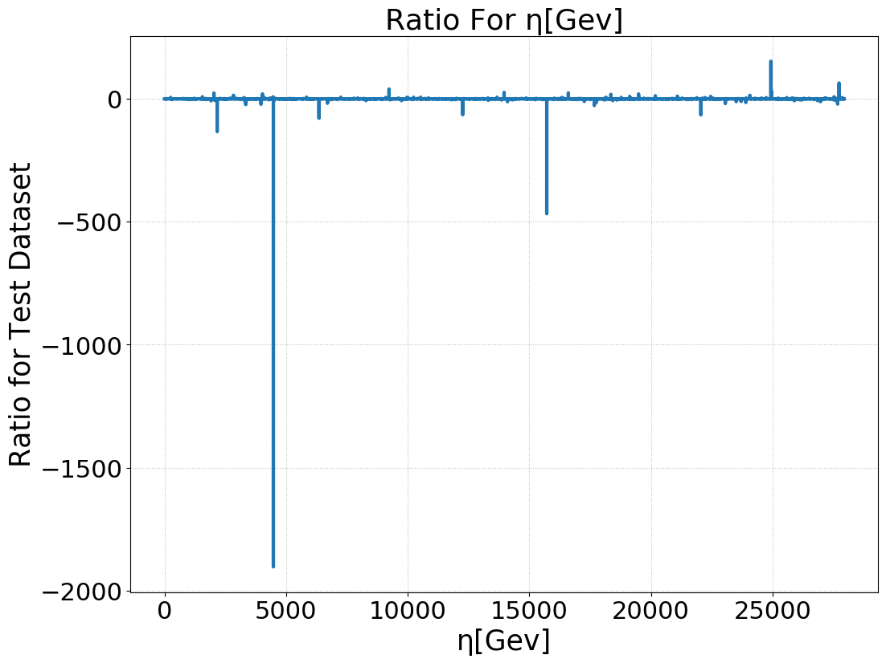
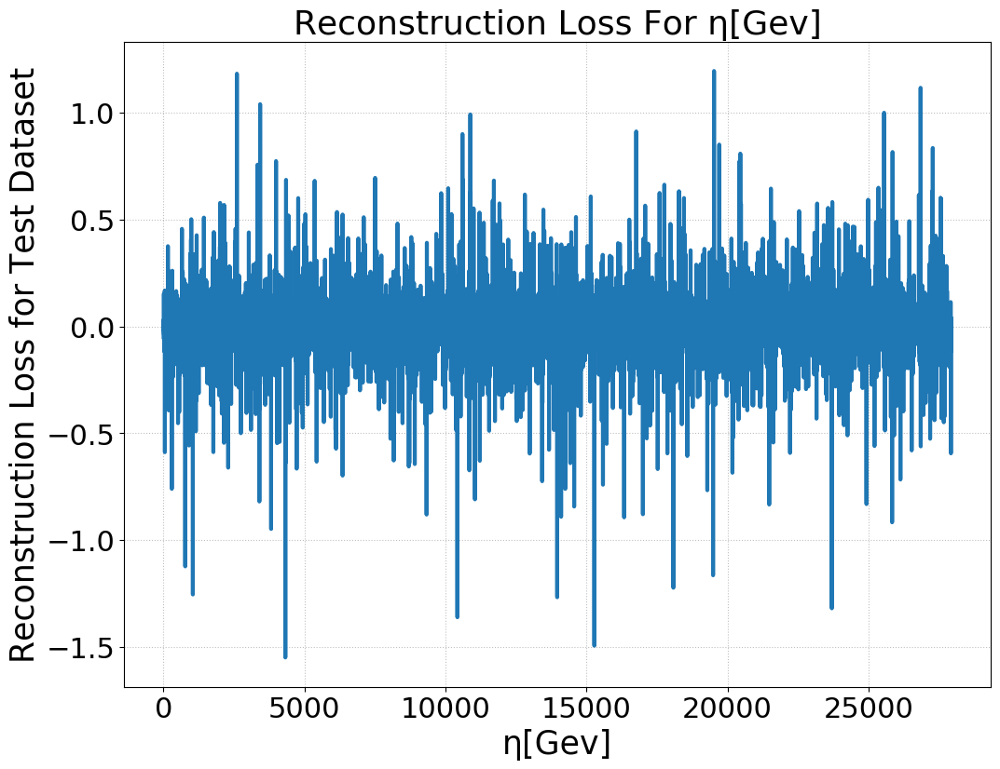

# Autoencoders-Compression
- The google colab repository for the code can be found [here](https://colab.research.google.com/drive/13OWQS9fP4pXmpbF3IC826JCulUCVPfR0)
- The jupyter notebook containing the code is [attached](./Auto_Encoder_Exercise.ipynb).
- The datasets are [training](./all_jets_train_4D_100_percent.pkl) and [testing](./all_jets_test_4D_100_percent.pkl).
- The files ['my_matplotlib_rcparams'](./my_matplotlib_rcparams) and ['my_matplotlib_style.py'](./my_matplotlib_style.py) define functionalities for matplotlib plotting functions.
- The file ['plot_activation_functions.py'](./plot_activation_functions.py) consits functions for plotting activation graphs.
- The file ['utils.py'](./utils.py) consists of functions for plotting the graphs.
- The files ['nn_utils.py'](./nn_utils.py) and ['my_nn_utility.py'](./my_nn_utility.py) consists of various network models.
#### Results and Plots:
- The ratio and reconstruction plots can be found [here](./images)
- (Original-uncompressed)/Original ratio for m[Gev] 
- (Original-uncompressed)/Original ratio for pt[rad] 
- (Original-uncompressed)/Original ratio for phi[rad] 
- (Original-uncompressed)/Original ratio for eta[Gev] 

- Reconstruction Loss for m[Gev] 
- Reconstruction Loss for pt[rad] 
- Reconstruction Loss for phi[rad] 
- Reconstruction Loss for eta[Gev] 
